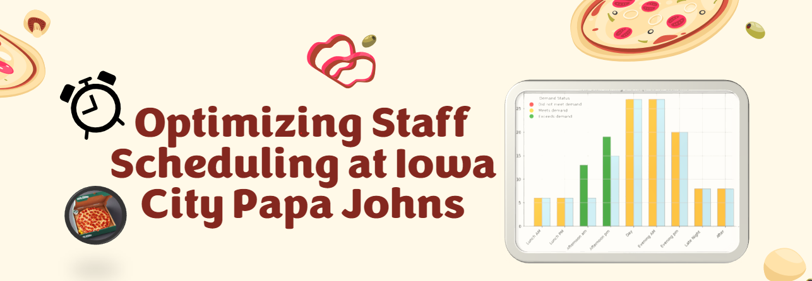

# Staff Scheduling Optimization for Papa John's Iowa City

## Project Overview
This repository includes the code, report, and presentation for optimizing staff scheduling at Iowa City Papa John's. The project employs an integer linear programming (ILP) model to automate and enhance the efficiency of the existing manual scheduling process. Minimalistic data visualization is utilized to clearly present the results and insights.



## Repository Structure
- **`staff_scheduling_optimization.ipynb`**: Jupyter notebook with the code for the optimization model using Pyomo.
- **`staff_scheduling_paper.pdf`**: Detailed report describing the problem, methodology, data analysis, model development, results, and challenges.
- **`staff_scheduling_presentation.pdf`**: Summary of key findings, insights, and takeaways in presentation format.

## Problem Description
Papa John's in Iowa City faces challenges in optimizing staff schedules to handle varying customer demand throughout the week. The existing manual scheduling process is both time-consuming and inefficient. This project introduces a linear programming-based solution to optimize shift lengths and staffing levels, reducing labor costs and improving overall efficiency.

## Data and Approach
### Data
The data for this project includes:
- **Shift schedules, sales, and orders** from September 3-9, 2018.
- Specific adjustments were made to accommodate the peak demand during a football game weekend.

### Optimization Model
The model leverages integer linear programming techniques to determine the optimal number of full-time and part-time staff required for different shifts. Key components include:
- **Decision Variables**: Represent the number of staff required to start at each shift.
- **Objective Function**: Minimize the total number of employees needed while meeting demand.
- **Constraints**: Ensure adequate staffing levels without exceeding specified limits.

For a more detailed explanation, you can refer to the [documentation](staff_scheduling_paper.pdf) or the code in the Jupyter notebook.

## Key Results
- The optimized model consistently met or exceeded staffing demands, particularly during peak periods.
- A significant reduction in manual scheduling effort and potential labor costs was observed.
- The flexibility to modify the model allows for adaptation to future changes in sales and demand.

## Challenges
- Balancing "soft" constraints like employee morale and minimizing overtime.
- Limitations in using historical data for modeling due to shifts in demand patterns.
- The complexity of integrating all possible constraints into a feasible model.

## How to Use the Model
1. **Install Dependencies**: Ensure you have Python and the required libraries installed. The primary library used is `Pyomo`.
```bash
pip install pyomo
```
2. **Run the Model**: Open the Jupyter notebook (`staff_scheduling_optimization.ipynb`) and execute the cells to see the optimization results.
3. **Modify Input Data**: The model can be easily adjusted by changing the sales and demand data to reflect updated conditions.

## Learn More
- [Introduction to Linear Programming](https://en.wikipedia.org/wiki/Linear_programming)
- [Getting Started with Pyomo](http://www.pyomo.org/)
- [Optimization Techniques in Operations Research](https://www.informs.org/Explore/Operations-Research-Analytics)

## Authors
- [Grace Trane](https://github.com/gtrane)
- [Arun Ganapathy](https://github.com/@arun98aol)
- Michael Neuhaus 
- Carrie Cox 

## License
This project is licensed under the MIT License - see the LICENSE file for details.

## Contact
For any questions (including access to the dataset) or feedback, feel free to reach out via GitHub or through our project presentation.
